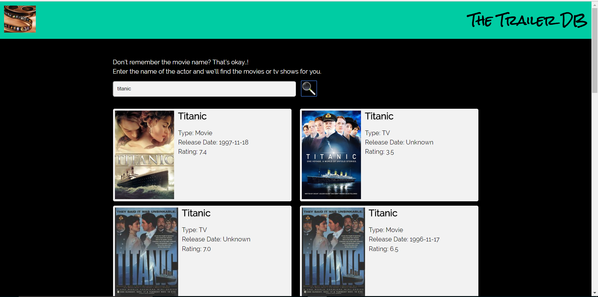
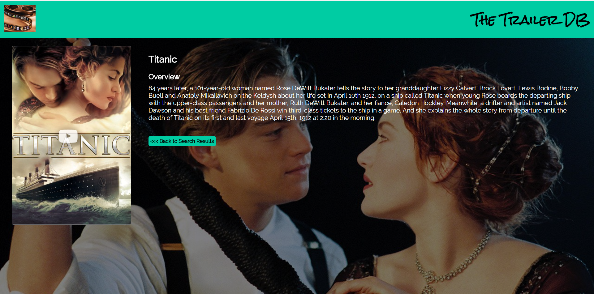

# Trailer Search

## Summary:
The Trailer Search app provides a sneak peek into movies and TV series or shows, whether it be yet-to-release upcoming ones or long lost old ones. The app allows you to look up trailers of movies and shows, which could definitely help to narrow down the answers to the question 'What to watch next?'. Further, it also gives you information on the rating as well as an overview on the movie or TV show. 
Another great feature of the app is that it allows you to search movies or TV shows based on the actor your looking for. This helps to discover more movies or shows from a particular actor that you liked and check out if any of his or her other movies catch your attention.
This app has been developed using [The Movie DB API](https://www.themoviedb.org/documentation/api).

## Technology Used:
* HTML
* CSS
* JavaScript
* jQuery

## Third-party JS/CSS Used:
* Font Awesome Icons
* Lightbox using lity
* Google Web Fonts